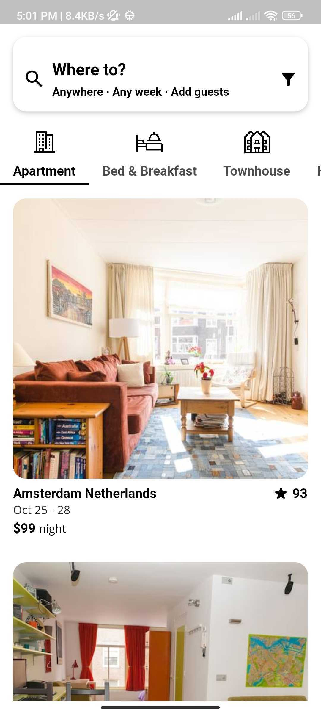

# Airbnb Flutter App

|  |  |  |
| :-----------------------------------------------: | :-------------------------------------------------------: | :-------------------------------------------------------: |

<table style="width:100%; table-layout:fixed;">
  <tr>
    <td style="width:33%; text-align:center;"></td>
    <td style="width:33%; text-align:center;"></td>
    <td style="width:33%; text-align:center;"></td>
  </tr>
</table>

This is a Flutter app that allows users to browse and search for various types of accommodation, such as apartments, bed and breakfasts, townhouses, lofts, and guesthouses. Users can view the availability of each listing with its corresponding ratings and price for one night.

## Features

- Browse and search for various types of accommodation
- View availability, ratings, and price for each listing
- Search for listings by location

## Installation

To run the app locally, follow these steps:

1. Clone the repository to your local machine
2. Make sure you have the Flutter SDK installed
3. Run `flutter pub get` to install dependencies
4. Run `flutter run` to launch the app on your emulator or physical device

## Technologies Used

- Flutter SDK
- Dart programming language

